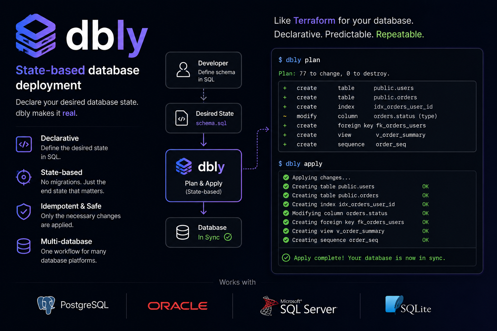

<p align="center">
  
</p>

<p align="center"><b>Declare your desired database state in git. dbly makes it real.</b></p>

---

**dbly** deploys your database objects — tables, views, functions, procedures, packages,
triggers, grants — from version control to **PostgreSQL, SQL Server, Oracle and SQLite**.
You keep one SQL file per object, like normal source code; dbly works out what changed and
brings the target database in sync. Think *Terraform for your database*: **declarative,
predictable, repeatable.**

## Why

- **Declarative** — your repo is the source of truth. No hand-written migration chains, no
  version-number collisions on parallel branches.
- **Plan before apply** — preview exactly what will run, then execute. No surprises.
- **Idempotent & safe** — only the necessary changes are applied. Additive changes go
  automatically; destructive ones (dropping columns, etc.) are flagged and never run unless
  you explicitly allow them.
- **Multi-database** — one workflow across all four engines.

## Install

```sh
uv sync                 # PostgreSQL + SQLite work out of the box
uv sync --extra oracle  # add the Oracle driver
uv sync --extra mssql   # add the SQL Server driver
uv sync --extra all     # both
```

## Organize your repo

One file per object; folder names map to database schemas. Use any extension you like
(`.sql`, `.tbl`, `.vw`, `.prc`, …) — dbly reads the SQL to know what each object is.

```
db/
  sales/
    customer.tbl
    v_open_orders.vw
    grants.sql
  init/                 # optional: privileged greenfield groundwork (CREATE DATABASE/ROLE…)
  migrations/           # optional: ordered, run-once ALTERs for renames / data backfills
hooks/pre/  hooks/post/  # optional: .sql or .py hooks (e.g. ArcGIS/ArcPy steps)
.dbignore               # files in the repo that should not be deployed
```

Most changes are declarative — edit the object file, dbly figures out the additive diff. For
changes the diff can't do safely (renaming a column, moving data), drop an ordered script in
`migrations/` (`0001_…sql`); it runs exactly once, is recorded in the ledger, and the table
it touches defers to it for that deploy. On a fresh database, migrations are *baselined*
(recorded, not run) since the object files already describe the end state.

## Project configuration (optional)

For anything beyond the defaults, drop a `dbly.toml` at the repo root. It's optional — without
it, `--target` is a profile path and the schema is the first folder segment.

```toml
object_root = "pgsql/schema"     # objects live here; schema = first segment BELOW this root
environment = "postgres"         # default engine when a profile omits environment=
ignore = ["**/*_1252.sql"]       # extra ignore patterns, merged with .dbignore

[targets]                        # dbly plan --target dev  →  resolves to the profile path
dev  = "conn/dev.properties"
beta = "conn/beta.properties"
prod = "conn/prod.properties"
```

`object_root` is the key that lets dbly sit on an existing repo whose objects live deeper than
the top level (e.g. `pgsql/schema/<schema>/<object>`): the schema is derived *relative to the
root*, so `pgsql/schema/sales/customer.tbl` maps to schema `sales`, not `pgsql`. Put root-level
keys (`object_root`, `environment`, `ignore`) **before** the `[targets]` table (TOML rule).

## Connect

A connection profile (reuses the familiar `connection.properties` format):

```properties
environment=postgres            # postgres | sqlserver | oracle | sqlite
service=db.example.com:5432
username=app
password=${DB_PASSWORD}         # ${ENV} placeholders → keep secrets out of the repo (CI/CD-safe)
database=appdb
```

## Use

**→ Full walkthrough: [docs/USAGE.md](docs/USAGE.md)** — every workflow, step by step.

```sh
# the core loop: preview, then execute (--to is any git ref)
dbly plan  --target prod --to main
dbly apply --target prod --to main

# adopt a database deployed out-of-band (psql/DataGrip) — record the ref, run no SQL
dbly baseline --target prod --to HEAD

# deploy just part of the repo, pulling in only the cross-schema objects it needs
dbly apply --target beta --schema download --with-deps

# has the database drifted from the desired state? (--show-diff shows what changed in each view)
dbly check  --target prod --show-diff

# fast edit→preview loop against uncommitted changes
dbly plan  --target dev --worktree

# what is currently deployed?
dbly status --target prod

# export a plain SQL script for a hand/offline deploy, or reverse a live DB to DDL
dbly plan   --target prod --to main --sql deploy.sql
dbly export --target prod --dialect postgres --out schema.sql
```

**Typical workflow:** edit your object files → commit → `dbly plan` to review → `dbly apply`.
Destructive steps require `--allow-destructive`. See the [guide](docs/USAGE.md) for scoped
deploys, migrations, drift-checking, hooks and the full command reference.

## Documentation

- **[Usage guide](docs/USAGE.md)** — task-oriented walkthrough of every workflow.
- **Architecture decisions:** [ADR 0001 — view drift via engine canonicalization](docs/adr/0001-view-drift-via-engine-canonicalization.md) ·
  [ADR 0002 — per-file application of replaceable objects](docs/adr/0002-per-file-application-of-replaceable-objects.md).
- **[CHANGELOG](CHANGELOG.md)**.

## Built for trunk-based development

Database teams are usually locked out of trunk-based development: migration scripts collide
on parallel branches, and "merge" effectively means "deploy to the customer". dbly is
designed to break that deadlock for teams who write their logic **in SQL, in the database**:

- **No migration numbers, no collisions.** Two developers edit different objects — git
  merges them like any other code. Integrate early, every day.
- **Merge ≠ deploy.** The trunk is your desired state; `dbly apply --to <tag>` ships the ref
  you choose, in the maintenance window you choose. Release *what* you want, *when* you want.
- **One trunk, every customer.** dbly reads each database's real state, so customers on
  different versions are no problem.

Integrate continuously, deploy on your own schedule — trunk-based development, finally
practical for state-based database developers.

## Status

Early alpha — all four engines are implemented and tested against live databases.

## License

MIT
